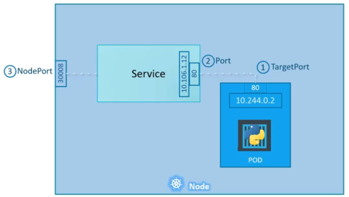

# DevOps::kubernetes

## required top-level entries in a yaml file

```
apiVersion: 
kind: 
metadata: 
spec: 
```


## basic yaml for Pod

```yaml
apiVersion: v1
kind: Pod
metadata:
  name: $pod-name
  labels:
    key: $value
spec:
  containers:
    - name: $container-name
      image: $docker-image
    # it can have multiple containers here
```


## basic yaml for ReplicaSet

```yaml
apiVersion: apps/v1
kind: ReplicaSet
metadata:
  name: $replicaset-name
  labels:
    key: $value
spec:
  replicas: $number
  template:
    $pod-metadata
    $pod-spec
  selector:
    matchLabels: # could be 'matchExpressions'
      pod-label-key: $pod-label-value
```


## basic yaml for Deployment

```yaml
apiVersion: apps/v1
kind: Deployment
metadata:
  name: $replicaset-name
  labels:
    key: $value
spec:
  replicas: $number
  template:
    $pod-metadata
    $pod-spec
  selector:
    matchLabels: # could be 'matchExpressions'
      pod-label-key: $pod-label-value
```


## create a Pod yaml file from CLI

```sh
kubectl run \
  redis --image=redis \
  --dry-run=client \
  -o yaml
```


## create a Deployment yaml from CLI

```sh
kubectl create deployment \
  httpd-frontend \
  --image=httpd:2.4-alpine \
  --replicas=3 \
  --dry-run=client \
  -o yaml
```


## basic yaml for a Service NodePort 

```yaml
apiVersion: v1
kind: Service
metadata:
  name: $service-name
spec:
  type: NodePort
  ports:
    # ports config
  selector:
    key: $pods-label-value
```

## Service NodePort ports config

```yaml
- port: $service-port-connected-to-pods-port
  targetPort: $pod-port
  nodePort: $port-available-to-outworld
```


## Service NodePort image




## What is ClusterIP Service used for?

Allow communication between pods.
(pods and their IPs are ephemeral)


## basic yaml for Service ClusterIP

```yaml
apiVersion: v1
kind: Service
metadata:
  name: $service-name
spec:
  # optional (ClusterIP is the default)
  type: ClusterIP 
  ports:
    - targetPort: $pods-port
      port: $services-port
  selector:
    label-key: $label-value
    # more labels key-values
```

## 6 basic components of a kubernetes cluster

- API Server
- etcd
- Scheduler
- Controller
- Container Runtime
- Kubelet

## API Server responsibility

Acts as a frontend for kubernetes.

When you use the `kubectl` command, you're interacting with the API Server.

## etcd responsibility

It's a key-value store used to store the data needed to manage the cluster.


## Controller responsibility

Responsible to respond when containers/endpoints go down.

## Scheduler responsibility

Responsible to distribute work across multiple nodes.


## Container Runtime responsibility

Underlying software responsible to run the containers.


## Kubelet responsibility

An agent running on each node. Responsible to make sure the containers are running as expected.

## Custom entries for container's `/etc/hosts` 

Add `hostAliases` to PodSpec:
```yaml
spec:
  hostAliases:
    - ip: "127.0.0.1"
      hostnames:
        - "foo.local"
```

Note: any content in the container's `/etc/hosts` will be overwritten by kubernetes.


## 2 ways to set env variables in kubernetes

- ConfigMap
- Secret


## ConfigMap yaml file

```yaml
apiVersion: v1
kind: ConfigMap
metadata:
  name: ${configMapName}
data:
  KEY: ${value}
  KEY2: ${value2}
```


## Accessing the ConfigMap/Secret in Pods

Basic usage: Filling the env vars with the ConfigMap/Secret contents.

In a Pod's spec:
```yaml
containers:
  - envFrom:
    - configMapRef: # secretRef
        name: ${configMapName}
```
**Note**: `name` indentation can be tricky.


## 3 ways to reference ConfigMap/Secret in Pods

- env vars from whole ConfigMap/Secret
- a single env var from the ConfigMap/Secret
- mount the ConfigMap/Secret in a volume


## Mount a ConfigMap/Secret in a volume

In a Pod's spec:
```yaml
containers:
  volumes:
  - name: ${appConfigVolume}
    configMap: # secret
      name: ${configMapName}
```
It creates a directory `/opt/${configMapName}` with the contents of the ConfigMap/Secret in files.


